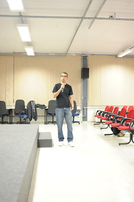

### Hi, I'm R.Pissardini 

 I'm a Computer Scientist (since 1997) and M.Sc. in Transportation Engineering. Currently my main interests include GNSS, Autonomous Vehicles and Artificial Intelligence applied to Transportation.

:electron: **Academic experience:** Data Science, Statistical analysis, Navigation and Positioning by Satellites, Intelligent Transportation Systems.

💻 **Main Skills**: Database management (SQL and NoSQL), Python, PHP, C, Fortran, Web Development(HTML5, CSS3, Bootstrap), Parallel Programming.

###### Find me around the web 
💬 [Google Scholar Profile](https://scholar.google.com.br/citations?user=kAfMCzkAAAAJ)
